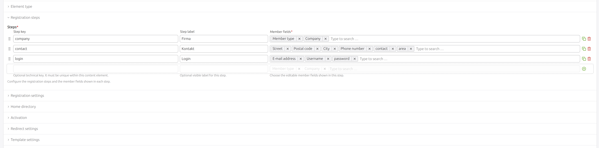

# Contao Multi-Step Registration

Reusable Contao 5.7 extension that provides a configurable multi-step frontend registration content element for `tl_member`.



## Requirements

- PHP 8.4
- Contao 5.7
- `codefog/tags-bundle` 3.4 or newer for the sortable backend field selector

## Installation

Install the bundle with Composer or contao manager:

```bash
composer require heimrichhannot/contao-multi-step-registration
```

Update the database afterward.

## Configuration

Create a content element of type `huh_multi_step_registration` and configure the registration steps in the `msrSteps` row wizard.

Each step contains a key, a backend label and the member fields for that step. The member field selector uses Codefog's `cfgTags` widget with sorting enabled, so editors can drag selected fields into the exact frontend order. New tags are disabled; the available values are generated from `tl_member` fields with `eval.feEditable`, matching Contao's registration field eligibility.

## Twig Template

You can customize the frontend output creating a variant template of `content_element/multi_step_registration`

An optional Symfony UX Turbo variant is available as `content_element/multi_step_registration/ux-turbo`.
Use it only in host projects that install and load `symfony/ux-turbo`. It wraps the content element in a
Turbo frame, submits intermediate steps asynchronously and keeps final registration redirects as full-page
navigations.

## Runtime Behavior

The frontend form is implemented as a Symfony form flow:

- `MemberRegistrationFlowType` builds one flow step per configured row.
- `MemberRegistrationStepType` maps the selected `tl_member` fields into Symfony form fields.
- `NavigatorFlowType` renders previous, next and finish controls.
- Flow state is stored in the session with a content-element-specific key.
- The root form uses Contao CSRF options, so the hidden token field is `REQUEST_TOKEN` and validation uses `contao.csrf.token_manager`.
- Successful step submissions use POST/Redirect/GET with HTTP 303 responses. Invalid submissions render
  the current form with HTTP 422 so Turbo can replace the frame with validation errors.

Member fields are derived from DCA configuration. The mapper handles labels, help texts, mandatory fields, length constraints, selected `rgxp` rules, unique checks, multiple values, DCA options and compatible save callbacks.

On final submission the bundle creates the member and mirrors core registration behavior where applicable:

- password hashing,
- duplicate cleanup for expired registrations,
- activation token and activation mail handling,
- admin notification,
- home directory assignment,
- `createNewUser` and `activateAccount` hooks,
- version creation,
- configured redirects or inline success messages.

## Notes
This extension was largely built with AI, but reviewed and tested by a human. :)
